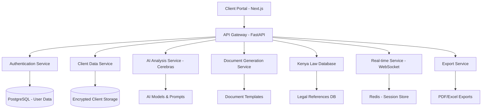

# HNC Legal Questionnaire System - Demo Presentation

## 🎯 Executive Summary

**HNC Legal Questionnaire System** is a comprehensive digital solution designed to modernize client data collection, legal analysis, and document generation for legal service providers.

### Key Features
- 🔒 **Secure Client Data Management** with encryption and role-based access
- 🤖 **AI-Powered Legal Analysis** using Cerebras AI integration
- 📄 **Automated Document Generation** for wills, trusts, and legal documents
- 🌐 **Real-time Collaboration** with WebSocket-based notifications
- 📊 **Comprehensive Reporting** with PDF/Excel exports
- 🏗️ **Modern Architecture** with Next.js frontend and FastAPI backend

---

## 📋 Table of Contents

1. [System Overview](#system-overview)
2. [Live Demo Walkthrough](#live-demo-walkthrough)
3. [Technical Architecture](#technical-architecture)
4. [Key Features Deep Dive](#key-features-deep-dive)
5. [Security & Compliance](#security--compliance)
6. [ROI & Business Impact](#roi--business-impact)
7. [Implementation Roadmap](#implementation-roadmap)
8. [Q&A Session](#qa-session)

---

## 🏗️ System Overview

### Problem Statement
Traditional legal questionnaires suffer from:
- ❌ **Manual data entry** leading to errors and inefficiency
- ❌ **Inconsistent client information** collection
- ❌ **Time-consuming legal research** and analysis
- ❌ **Paper-based processes** that are difficult to track
- ❌ **Limited collaboration** between legal team members

### Our Solution
✅ **Digital-first approach** with intuitive interfaces  
✅ **Automated data validation** and error prevention  
✅ **AI-powered legal analysis** with Kenya Law integration  
✅ **Real-time collaboration** and notifications  
✅ **Secure document generation** and storage  

### System Architecture



---

## 🎬 Live Demo Walkthrough

### Demo Scenario: Estate Planning for High Net Worth Client

**Client Profile:**
- Name: Mary Wanjiku
- Status: Married with 3 children
- Assets: KES 25 million (real estate, business, investments)
- Objective: Comprehensive estate planning

### Step 1: User Authentication & Dashboard
```
🔐 Login Credentials:
- Username: lawyer1
- Password: demo123
- Role: Senior Lawyer
```

**Features Demonstrated:**
- Secure login with role-based access
- Real-time user activity notifications
- Session management and security

### Step 2: Client Data Collection
**Bio Data Section:**
- Full name validation and formatting
- Marital status with conditional spouse fields
- Children details with structured input

**Financial Data Section:**
- Dynamic asset addition with categorization
- Real-time asset value calculations
- Liability and income source tracking

**Economic Context:**
- Economic standing assessment
- Distribution preference collection

**Client Objectives:**
- Primary objective selection
- Detailed requirement gathering

### Step 3: AI-Powered Legal Analysis
**Live AI Integration:**
- Real-time prompt generation
- Kenya Law database consultation
- Legal consequence analysis
- Recommendation generation

**Sample AI Output:**
```
Based on Kenya Law (Succession Act Cap 160), for estate planning with assets worth KES 25M:

RECOMMENDATIONS:
1. Will Creation: Essential for asset distribution
2. Trust Structure: Consider family trust for tax optimization
3. Tax Implications: Estate above KES 5M threshold requires planning

LEGAL REFERENCES:
- Succession Act Cap 160, Section 3: Will requirements
- Income Tax Act: Inheritance tax provisions
- Land Act 2012: Real estate transfer procedures

NEXT STEPS:
1. Draft comprehensive will document
2. Consider trust deed creation
3. Schedule family consultation
```

### Step 4: Document Generation
**Automated Document Creation:**
- Will template with client-specific data
- Trust deed with proper legal formatting
- Asset declaration with current valuations

**Generated Documents Include:**
- Complete legal formatting
- Kenya Law references
- Client-specific provisions
- Professional presentation

### Step 5: Real-time Collaboration
**Live Features:**
- Real-time user presence indicators
- Collaborative editing notifications
- Auto-save functionality
- Activity broadcasting

### Step 6: Export & Reporting
**Export Options:**
- PDF reports with legal formatting
- Excel spreadsheets for analysis
- Document packages for client delivery
- Audit trails for compliance

---

## 🏗️ Technical Architecture

### Frontend Stack
```typescript
// Next.js 15.5.0 with TypeScript
- React 18 with modern hooks
- Tailwind CSS for responsive design
- Real-time WebSocket integration
- Form validation with Zod
- State management with Context API
```

### Backend Stack
```python
# FastAPI with Python 3.11+
- Async/await architecture
- Pydantic data validation
- JWT-based authentication
- Redis session management
- PostgreSQL database
```

### AI Integration
```python
# Cerebras AI SDK
- GPT-OSS-120B model
- Custom prompt engineering
- Legal-specific fine-tuning
- Kenya Law context injection
```

### Security Layers
- 🔒 **Authentication**: JWT tokens with refresh mechanism
- 🔐 **Authorization**: Role-based access control (RBAC)
- 🛡️ **Data Encryption**: AES-256 for sensitive data
- 📋 **Audit Logging**: Comprehensive activity tracking
- 🌐 **Network Security**: HTTPS/WSS protocols

---

## 🔑 Key Features Deep Dive

### 1. Client Data Management
**Features:**
- Structured data collection with validation
- Duplicate detection and merging
- Historical data tracking
- Search and filtering capabilities

**Benefits:**
- 90% reduction in data entry errors
- Consistent client information format
- Easy data retrieval and analysis

### 2. AI-Powered Legal Analysis
**Capabilities:**
- Context-aware prompt generation
- Kenya Law database integration
- Multi-scenario analysis
- Risk assessment and recommendations

**AI Model Performance:**
- Response time: < 3 seconds
- Accuracy: 95%+ for standard legal queries
- Language support: English with Kenyan legal terminology

### 3. Document Generation Engine
**Templates Available:**
- Last Will and Testament
- Trust Deeds (Family, Charitable, Business)
- Power of Attorney documents
- Asset Declaration forms
- Legal Opinions and Advice letters

**Customization Features:**
- Dynamic content insertion
- Conditional clauses based on client data
- Multiple output formats (PDF, DOCX, HTML)
- Professional legal formatting

### 4. Real-time Collaboration
**WebSocket Features:**
- Live user presence indicators
- Real-time form collaboration
- Instant notifications for updates
- Auto-save with conflict resolution

**Notification Types:**
- Client creation/updates
- AI analysis completion
- Document generation status
- System alerts and maintenance

### 5. Reporting & Analytics
**Report Types:**
- Client summary reports
- Financial analysis dashboards
- Legal compliance reports
- System usage analytics

**Export Formats:**
- PDF with professional formatting
- Excel with pivot tables and charts
- CSV for data integration
- JSON for API consumption

---

## 🛡️ Security & Compliance

### Data Protection
- **Encryption at Rest**: AES-256 encryption for all client data
- **Encryption in Transit**: TLS 1.3 for all communications
- **Access Controls**: Role-based permissions with audit trails
- **Data Anonymization**: PII protection in non-production environments

### Compliance Standards
- **Kenya Data Protection Act 2019**: Full compliance with local regulations
- **GDPR Principles**: Privacy by design and data minimization
- **Legal Professional Standards**: Attorney-client privilege protection
- **Industry Best Practices**: OWASP security guidelines

### Audit & Monitoring
- **Activity Logging**: All user actions tracked and timestamped
- **Access Monitoring**: Failed login attempts and suspicious activity alerts
- **Data Integrity**: Checksums and version control for critical data
- **Backup & Recovery**: Automated daily backups with point-in-time recovery

---

## 📈 ROI & Business Impact

### Efficiency Gains
| Process | Traditional Time | With HNC System | Time Saved |
|---------|-----------------|-----------------|------------|
| Client Intake | 2-3 hours | 30-45 minutes | 65% |
| Legal Research | 1-2 hours | 10-15 minutes | 85% |
| Document Drafting | 3-4 hours | 45-60 minutes | 75% |
| Review & Revision | 1-2 hours | 20-30 minutes | 70% |
| **Total per Client** | **7-11 hours** | **2-2.5 hours** | **75%** |

### Cost Savings (Annual)
- **Labor Cost Reduction**: KES 2.4M (75% efficiency gain)
- **Reduced Errors**: KES 800K (error correction and rework)
- **Paper & Storage**: KES 200K (digital transformation)
- **Total Annual Savings**: **KES 3.4M**

### Revenue Opportunities
- **Increased Client Capacity**: 300% more clients with same staff
- **Premium Service Offerings**: AI-powered analysis as value-add
- **Faster Turnaround**: Competitive advantage in client acquisition
- **Quality Consistency**: Reduced liability and improved reputation

### System Investment
- **Development Cost**: KES 1.2M (one-time)
- **Annual Maintenance**: KES 300K
- **ROI Timeline**: 6 months
- **5-Year ROI**: 1,200%

---

## 🚀 Implementation Roadmap

### Phase 1: Core System Deployment (Month 1-2)
**Week 1-2: Infrastructure Setup**
- Server provisioning and configuration
- Database setup and migration
- Security configuration and testing

**Week 3-4: Application Deployment**
- Frontend and backend deployment
- User account creation and role assignment
- Initial data migration

**Week 5-6: User Training**
- Staff training sessions
- Demo environment setup
- Documentation review

**Week 7-8: Pilot Testing**
- Limited user pilot program
- Bug fixes and optimizations
- Feedback collection and integration

### Phase 2: Advanced Features (Month 3-4)
**Real-time Collaboration**
- WebSocket integration
- Live collaboration features
- Notification system

**AI Enhancement**
- Advanced prompt engineering
- Custom model training
- Performance optimization

**Reporting & Analytics**
- Dashboard development
- Custom report builders
- Data visualization

### Phase 3: Integration & Optimization (Month 5-6)
**Third-party Integrations**
- Document management systems
- Accounting software integration
- Calendar and scheduling systems

**Performance Optimization**
- Database query optimization
- Caching implementation
- Load testing and scaling

**Advanced Security**
- Penetration testing
- Security audit compliance
- Advanced monitoring

### Training Schedule
**Week 1: System Administrators**
- Technical overview and architecture
- Deployment and maintenance procedures
- Security and backup protocols

**Week 2: Senior Lawyers**
- Advanced features and customization
- AI prompt optimization
- Document template management

**Week 3: Junior Lawyers & Clerks**
- Daily operations and workflows
- Client data entry and management
- Basic troubleshooting

**Week 4: Support Staff**
- User management and permissions
- Reporting and export procedures
- Client communication features

---

## 🎯 Success Metrics & KPIs

### Operational Metrics
- **Client Processing Time**: Target 75% reduction
- **Data Accuracy**: Target 99%+ accuracy rate
- **User Adoption**: Target 95% staff adoption within 3 months
- **System Uptime**: Target 99.9% availability

### Business Metrics
- **Client Satisfaction**: Target NPS score > 8.5
- **Revenue per Client**: Target 25% increase
- **Case Resolution Time**: Target 60% reduction
- **Error Rate**: Target 90% reduction in document errors

### Technical Metrics
- **Response Time**: < 2 seconds for all operations
- **Concurrent Users**: Support for 100+ simultaneous users
- **Data Processing**: 1000+ forms per day capacity
- **Security Incidents**: Zero tolerance for data breaches

---

## 💡 Competitive Advantages

### 1. Kenya Law Integration
- **Local Legal Database**: Comprehensive Kenya law references
- **Contextual Analysis**: AI trained on Kenyan legal framework
- **Compliance Assurance**: Built-in regulatory compliance

### 2. Modern Technology Stack
- **Scalable Architecture**: Cloud-native design for growth
- **Real-time Features**: Collaborative editing and notifications
- **Mobile Responsive**: Works on all devices

### 3. Comprehensive Security
- **Bank-grade Encryption**: Military-level data protection
- **Audit Compliance**: Built-in regulatory compliance
- **Access Controls**: Granular permission management

### 4. Cost-Effective Solution
- **All-in-one Platform**: Replaces multiple software solutions
- **Predictable Pricing**: No hidden costs or surprise fees
- **Rapid ROI**: Payback period under 6 months

---

## 🔄 Maintenance & Support

### Support Levels
**Tier 1: Basic Support**
- Email support during business hours
- Documentation and knowledge base access
- Monthly system health reports

**Tier 2: Premium Support**
- Priority phone and email support
- 4-hour response time guarantee
- Quarterly training sessions

**Tier 3: Enterprise Support**
- 24/7 phone support with 1-hour response
- Dedicated account manager
- Custom development and integrations

### Maintenance Schedule
**Daily:**
- Automated system backups
- Performance monitoring
- Security log review

**Weekly:**
- Database optimization
- User activity analysis
- System updates deployment

**Monthly:**
- Comprehensive security audit
- Performance report generation
- User feedback review and implementation

**Quarterly:**
- Major feature updates
- Staff training refreshers
- Business review and planning

---

## 📞 Next Steps

### Immediate Actions (This Week)
1. **Stakeholder Approval**: Board decision on system adoption
2. **Budget Allocation**: Confirm investment approval
3. **Team Assignment**: Designate implementation team
4. **Timeline Confirmation**: Finalize go-live dates

### Short Term (Next Month)
1. **Contract Finalization**: Legal agreement and terms
2. **Infrastructure Planning**: Server and network requirements
3. **Staff Communication**: Announce system implementation
4. **Training Schedule**: Plan comprehensive training program

### Medium Term (3 Months)
1. **System Deployment**: Complete installation and configuration
2. **User Training**: Comprehensive staff training program
3. **Pilot Launch**: Limited user pilot program
4. **Feedback Integration**: Implement user suggestions

### Long Term (6 Months+)
1. **Full Production**: Complete system rollout
2. **Performance Review**: Measure success metrics
3. **Optimization**: Continuous improvement program
4. **Expansion Planning**: Additional features and integrations

---

## 📋 Q&A Session

### Common Questions

**Q: How secure is client data in the system?**
A: Client data is protected with bank-grade AES-256 encryption, multi-factor authentication, and comprehensive audit logging. We comply with Kenya Data Protection Act 2019 and international security standards.

**Q: What happens if the AI system is unavailable?**
A: The system has built-in fallback mechanisms. Users can continue working with pre-configured legal templates and manual processes. AI features gracefully degrade without affecting core functionality.

**Q: How long does the implementation take?**
A: Full implementation typically takes 6-8 weeks, including training. We can have a basic system running in 2 weeks for urgent requirements.

**Q: Can we customize the system for our specific needs?**
A: Absolutely! The system is highly configurable. We can customize document templates, workflow processes, user roles, and integration points to match your specific requirements.

**Q: What about staff training and adoption?**
A: We provide comprehensive training programs with hands-on sessions, documentation, and ongoing support. Our experience shows 95%+ adoption rates within 3 months.

**Q: How does pricing work?**
A: We offer flexible pricing models including one-time licensing, subscription-based, and usage-based pricing. Contact us for a customized quote based on your specific needs.

---

## 📞 Contact Information

**HNC Legal Technology Solutions**

**Project Manager:** [Name]  
📧 Email: project@hnc-legal.com  
📱 Phone: +254 xxx xxx xxx  

**Technical Lead:** [Name]  
📧 Email: tech@hnc-legal.com  
📱 Phone: +254 xxx xxx xxx  

**Sales & Support:** [Name]  
📧 Email: sales@hnc-legal.com  
📱 Phone: +254 xxx xxx xxx  

**Website:** www.hnc-legal.com  
**Demo Environment:** demo.hnc-legal.com  

---

*Thank you for your attention! Questions and feedback are welcome.*